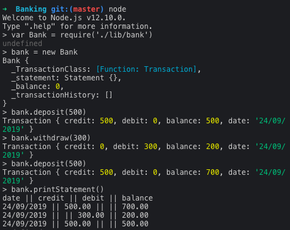

# Banking

An app which can record deposits and withdrawals into a bank account as well as printing off a bank statement of past transactions.

## Installation
download the repo into your Projects folder using:

```bash
git@github.com:Stegosauruss/Banking.git
```
change directory into the banking directory then run
```bash
npm install
```
to install dependencies.

## How to use
run node
```bash
node
```
require the bank class
```node
var Bank = require'./lib/bank.js'
```
Create a new Bank
```node
bank = new Bank()
```
To make a withdrawal of £50 use
```node
bank.withdraw(50)
```
To make a deposit of £30 use
```node
bank.deposit(30)
```
To print your statement use
```node
bank.printStatement()
```


## User Stories

```
As a user,
In order to store my money,
I would like to make a deposit at a particular date.
```

```
As a user,
In order to access my money,
I would like to make a withdrawal at a particular date.
```

```
As a user,
In order to see which transactions I have conducted,
I would like to print a bank statement.
```

```
As a user,
In order to never go into a negative balance,
I would like to see an error message when I try to withdraw money I do not have.
```

## Testing
Within the project folder Run:
Tests using
```bash
npm run test

```
Or to see coverage
```bash
npm test -- --coverage
```

Run the linter using
```bash
eslint .  
```

## Domain Model
I want to ensure that my classes have one responsibility. I originally began my domain model with two classes. An interface named ATM and a class called Bank which stored transaction history.

When I was completing the logic required for printing a statement it became clear to me that ATM was picking up methods which could be stored somewhere else so I seperated out those methods into their own class.

I realised that my atm was only acting as an interface and did not have any responsibilities of it's own so I removed it from my model. I also added a Day class to return the correct date format.

After this change I realised that my Bank class has too many responsibilities. It stores the balance and also creates logs of transactions. I decided to seperate out the transactions into their own class.

